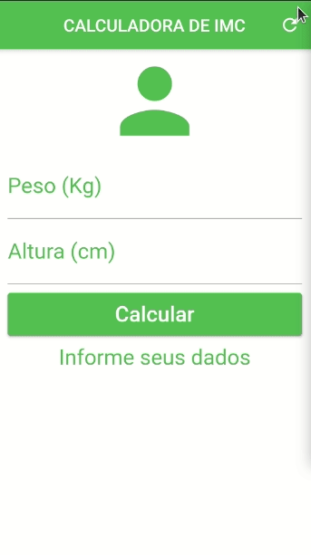
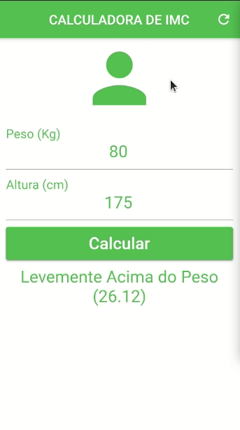

## CALCULADORA IMC

   

## Descrição do Projeto

Flutter App - Calculadora de índice de massa corporal com feedback sobre o resultado.

<h4 align="center"> 
	✅  Finalizado  ✅
</h4>

  
  

Tecnologias

-  [Flutter](https://flutter.dev/)
-  [Dart](https://dart.dev/)
-  [VS code](https://code.visualstudio.com/)

-  [Android Studio](https://developer.android.com/studio)

# Baixar aplicativo 📲
 :exclamation: Nota: O apk disponível para download é um apk grande que funciona na maioria das arquiteturas android. Se você  quiser um apk de tamanho pequeno, clone este repositório e gere um usando o Android Studio ou Visual Studio Code.

<a href="">

</ a>

Feito com ♥ por Ricardo Monteiro  [Entrar em contato!](https://www.linkedin.com/in/ricardohmonteiro/)

